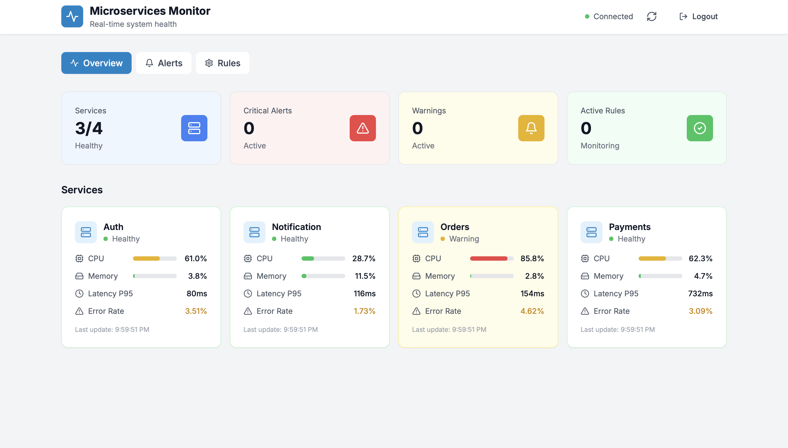

# Microservices Platform

A production-grade distributed event-driven microservices system built entirely in Go with a Next.js dashboard for real-time monitoring and alerting.

## 📸 Dashboard Preview



*Real-time monitoring dashboard showing service health, metrics, and alerts*

## 🏗 Architecture

```
┌─────────────────────────────────────────────────────────────────────────────┐
│                              Dashboard (Next.js)                             │
│                         Real-time Monitoring UI                              │
└─────────────────────────────────────────────────────────────────────────────┘
                                      │
                                      ▼
┌─────────────────────────────────────────────────────────────────────────────┐
│                             UI Backend (Go)                                  │
│                    REST API + WebSocket + JWT Auth                           │
└─────────────────────────────────────────────────────────────────────────────┘
                                      │
                    ┌─────────────────┼─────────────────┐
                    ▼                 ▼                 ▼
            ┌───────────┐     ┌───────────┐     ┌───────────┐
            │   Redis   │     │   Kafka   │     │  Jaeger   │
            │  Storage  │     │  Streams  │     │ Tracing   │
            └───────────┘     └───────────┘     └───────────┘
                    ▲                 │                 ▲
                    │    ┌───────────┴───────────┐     │
                    │    ▼                       ▼     │
            ┌───────────────────┐     ┌───────────────────┐
            │    Analyzer       │     │   Alert Engine    │
            │  Anomaly Detect   │────▶│   Multi-Channel   │
            └───────────────────┘     └───────────────────┘
                    ▲
                    │ service-metrics / service-logs
      ┌─────────────┼─────────────┬─────────────┬─────────────┐
      ▼             ▼             ▼             ▼             ▼
┌──────────┐ ┌──────────┐ ┌──────────┐ ┌──────────────┐
│   Auth   │ │  Orders  │ │ Payments │ │ Notification │
│ Service  │ │ Service  │ │ Service  │ │   Service    │
└──────────┘ └──────────┘ └──────────┘ └──────────────┘
```

## ✨ Features

### Microservices
- **Auth Service**: Authentication simulation with realistic metrics
- **Orders Service**: Order processing simulation with variable load patterns
- **Payments Service**: Payment gateway simulation with error scenarios
- **Notification Service**: Multi-channel notification simulation

### Analyzer Service
- Real-time anomaly detection
- Threshold-based alerting
- Statistical deviation detection (z-score)
- Error burst detection
- Sliding window analysis
- Rolling averages

### Alert Engine
- Multi-channel dispatch (Slack, Email, Webhook)
- Plugin-based architecture
- Alert grouping by service/type
- Suppression and deduplication
- Retry with exponential backoff
- Dead Letter Queue (DLQ)

### UI Backend
- RESTful API with JWT authentication
- WebSocket for real-time updates
- CORS support
- Pagination and filtering
- Dashboard statistics

### Dashboard (Next.js)
- Real-time metrics visualization
- Alert management with acknowledgment
- Threshold rule configuration (CRUD)
- Service health overview
- Responsive design with TailwindCSS

## 🚀 Getting Started

### Prerequisites
- Go 1.21+
- Node.js 20+
- Docker & Docker Compose
- Make

### Quick Start

1. **Clone the repository**
```bash
git clone <repository-url>
cd microservices-platform
```

2. **Start infrastructure**
```bash
make infra-up
```
This starts Kafka, Redis, Prometheus, Grafana, and Jaeger.

3. **Run all services**
```bash
make run-all
```

4. **Start the dashboard**
```bash
make dashboard-install
make dashboard-dev
```

5. **Access the applications**
- Dashboard: http://localhost:3001
- Kafka UI: http://localhost:8080
- Grafana: http://localhost:3000 (admin/admin)
- Prometheus: http://localhost:9090
- Jaeger UI: http://localhost:16686

### Docker Deployment

```bash
# Build all images
make docker-build

# Start everything
make docker-up

# View logs
make docker-logs

# Stop everything
make docker-down
```

## 📁 Project Structure

```
microservices-platform/
├── pkg/
│   └── shared/                 # Shared packages
│       ├── models/             # Domain models
│       ├── kafka/              # Kafka utilities
│       ├── logging/            # Structured logging
│       ├── tracing/            # OpenTelemetry tracing
│       ├── metrics/            # Prometheus metrics
│       ├── jwt/                # JWT utilities
│       ├── validation/         # Input validation
│       └── utils/              # Common utilities
├── services/
│   ├── auth/                   # Auth microservice
│   ├── orders/                 # Orders microservice
│   ├── payments/               # Payments microservice
│   ├── notification/           # Notification microservice
│   ├── analyzer/               # Anomaly detection service
│   ├── alert-engine/           # Alert dispatch service
│   └── ui-backend/             # API gateway service
├── dashboard/                  # Next.js frontend
│   └── src/
│       ├── app/                # Next.js App Router
│       ├── components/         # React components
│       └── hooks/              # Custom hooks
├── docker-compose.yml          # Full deployment
├── docker-compose.infra.yml    # Infrastructure only
├── prometheus.yml              # Prometheus config
├── Makefile                    # Build automation
└── go.work                     # Go workspace
```

## 🔧 Configuration

Each service uses environment variables for configuration. See `.env.example` files in each service directory.

### Key Configuration Options

| Service | Variable | Description | Default |
|---------|----------|-------------|---------|
| All | `KAFKA_BROKERS` | Kafka broker addresses | `localhost:9092` |
| All | `LOG_LEVEL` | Logging verbosity | `info` |
| All | `ENVIRONMENT` | Environment name | `development` |
| Analyzer | `REDIS_ADDR` | Redis address | `localhost:6379` |
| Alert Engine | `SLACK_WEBHOOK_URL` | Slack webhook | - |
| UI Backend | `JWT_SECRET` | JWT signing secret | Required |
| UI Backend | `JWT_EXPIRATION` | Token expiration (hours) | `24` |

## 📊 Metrics & Observability

### Prometheus Metrics
All services expose metrics at `/metrics`:
- `service_requests_total` - Request count by service
- `service_errors_total` - Error count by service
- `service_latency_seconds` - Request latency histogram
- `kafka_messages_produced_total` - Kafka messages produced
- `kafka_messages_consumed_total` - Kafka messages consumed

### Distributed Tracing
OpenTelemetry integration with Jaeger for request tracing across services.

### Logging
Structured JSON logging with correlation IDs using Uber's Zap library.

## 🔐 Authentication

The UI Backend uses JWT for authentication:

```bash
# Login
curl -X POST http://localhost:8007/api/auth/login \
  -H "Content-Type: application/json" \
  -d '{"username": "admin", "password": "admin"}'

# Use token
curl http://localhost:8007/api/services \
  -H "Authorization: Bearer <token>"
```

Default credentials:
- Admin: `admin` / `admin`
- Demo user: Any username with password `demo`

## 📝 API Endpoints

### Authentication
- `POST /api/auth/login` - Authenticate user
- `POST /api/auth/refresh` - Refresh token

### Services
- `GET /api/services` - List all services
- `GET /api/services/{service}/metrics` - Get service metrics

### Metrics
- `GET /api/metrics/latest` - Get latest metrics for all services

### Alerts
- `GET /api/alerts` - List alerts (with pagination)
- `GET /api/alerts/{id}` - Get alert details
- `POST /api/alerts/{id}/acknowledge` - Acknowledge alert

### Rules
- `GET /api/rules` - List threshold rules
- `POST /api/rules` - Create rule
- `PUT /api/rules/{id}` - Update rule
- `DELETE /api/rules/{id}` - Delete rule

### Dashboard
- `GET /api/dashboard/stats` - Get dashboard statistics

### WebSocket
- `GET /ws` - WebSocket connection for real-time updates

## 🧪 Testing

```bash
# Run all tests
make test

# Run tests with coverage
make test-coverage

# Lint code
make lint
```

## 📦 Building

```bash
# Build all services
make build

# Build specific service
make build-auth
make build-orders
# etc.

# Create release
make release
```

## 🐳 Kafka Topics

| Topic | Description | Partitions |
|-------|-------------|------------|
| `service-metrics` | Service metrics data | 3 |
| `service-logs` | Service log entries | 3 |
| `alerts` | Generated alerts | 3 |
| `alerts-dlq` | Failed alerts (DLQ) | 1 |

## 🛠 Development

### Adding a New Service

1. Create service directory under `services/`
2. Initialize Go module with `go mod init`
3. Add to `go.work` file
4. Implement using shared packages
5. Add to Makefile and Docker Compose

### Adding New Alert Dispatchers

Implement the `Dispatcher` interface in `services/alert-engine/internal/dispatchers/`:

```go
type Dispatcher interface {
    Name() string
    Dispatch(ctx context.Context, alert *models.Alert) error
    HealthCheck(ctx context.Context) error
}
```

## 📚 Additional Documentation

- [Load Simulation & Metrics Generation](docs/LOAD_SIMULATION.md) - Learn how the platform generates simulated metrics and load
- [Docker Deployment](DOCKER.md) - Detailed Docker deployment instructions

## 📜 License

MIT License - See LICENSE file for details.

## 🤝 Contributing

1. Fork the repository
2. Create a feature branch
3. Commit changes
4. Push to the branch
5. Create a Pull Request


